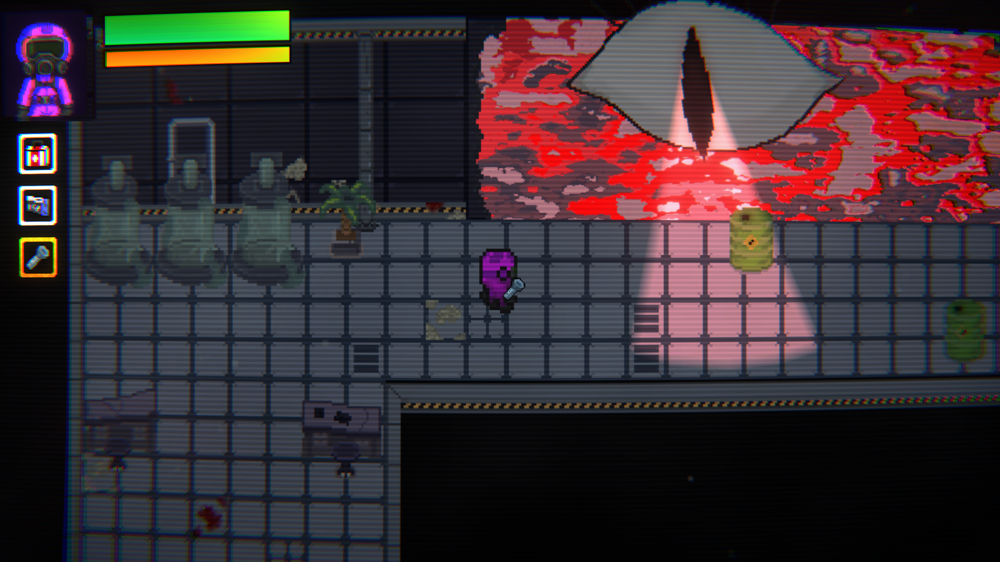

# ABYSS

**Abyss** es un roguelike / survival horror con vista cenital ¾, ambientado en unas instalaciones subterráneas bajo el volcán Galeras. El jugador asume el rol de **Esteban**, un técnico exmilitar encargado de recuperar un cristal energético conocido como *Lumenilo* antes de una inminente erupción volcánica.

La oscuridad, las criaturas mutadas y un entorno hostil ponen a prueba la habilidad, el sigilo y la capacidad de reacción del jugador.

## Características

- Generación procedural de habitaciones
- Mecánica de puertas con entidades que acechan en la oscuridad
- IA enemiga con pathfinding A*
- Narración ambiental
- Miniuegos con Quick Time Events
- Vista cenital con ambientación densa
- Música original y efectos de sonido envolventes

## Demo

**ADVERTENCIA:** Este juego contiene escenas de suspenso, criaturas perturbadoras y efectos sonoros que pueden afectar a personas sensibles.

[Version 0.4.0](https://github.com/jGekko/abyss/releases/tag/v0.4.0-beta)

## Capturas

